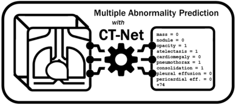

# ct-net-models



## Description

This repository contains Python code to train and evaluate convolutional neural network models (CNNs)
on the task of multiple abnormality prediction from whole chest CT volumes.
Our model CT-Net83 achieves state of the art performance on this task
and is described in detail in our [Medical Image Analysis paper](https://doi.org/10.1016/j.media.2020.101857).
The paper is also available [on arXiv](https://arxiv.org/ftp/arxiv/papers/2002/2002.04752.pdf).
The models are implemented in PyTorch.

On the RAD-ChestCT data set of 36,316 volumes
from 19,993 patients, CT-Net83 achieves a test set AUROC >0.90 for 18 abnormalities,
with an average AUROC of 0.773 across 83 abnormalities. 

If you find this work useful in your research, please consider citing us:

Draelos R.L., et al. "Machine-Learning-Based Multiple Abnormality Prediction with Large-Scale Chest Computed Tomography Volumes." *Medical Image Analysis* (2020).

## Requirements

The requirements are specified in *ctnet_environment.yml* and include
PyTorch, numpy, pandas, sklearn, scipy, and matplotlib.

To create the conda environment run:

`conda env create -f ctnet_environment.yml`

The code can also be run using the Singularity container defined [in this repository](https://github.com/rachellea/research-container).

## Usage

To run a demo of the CT-Net83, CT-Net9, BodyConv, 3DConv, and ablated CT-Net models on
fake data, run this command:

`python main.py`

The RAD-ChestCT data set [is publicly availalbe on Zenodo](https://zenodo.org/record/6406114).

Because the real dataset is large, currently this repository includes fake data files to enable demonstrating
the code and the required data formats. The fake data is located in *load_dataset/fakedata*.
The fake CTs were generated as follows: 

```
fakect = np.random.randint(low=-1000,high=1000,size=(10,10,10))
np.savez_compressed('FAKE000.npz',ct=fakect)
```

Note that 10 x 10 x 10 is too small for a real CT scan; the CT scans
in the RAD-ChestCT data set are on the order of 450 x 450 x 450 pixels.

## Organization

* *main.py* contains the experiment configurations needed to replicate the
results in the paper. The command `python main.py` will run a demo of the
CT-Net83, CT-Net9, BodyConv, 3DConv, and ablated CT-Net models on
fake data.
* *run_experiment.py* contains code for training and evaluting the models.
* *evaluate.py* contains code for calculating, organizing, and plotting performance
metrics including AUROC and average precision.
* *unit_tests.py* contains some unit tests. These tests can be run via `python unit_tests.py`
* *load_dataset/custom_datasets.py* contains the PyTorch Dataset class for the CT data.
* *load_dataset/utils.py* contains the code for preparing individual CT volumes, including
padding, cropping, normalizing pixel values, and performing data augmentation through
random flips and rotations.
* *load_dataset/fakedata* contains the fake data necessary to run the demo.
* *models/custom_models_ctnet.py* contains the CT-Net model definition.
* *models/custom_models_alternative.py* contains two alternative architectures,
BodyConv and 3DConv.
* *models/custom_models_ablation.py* contains the ablated variants of CT-Net.

## Comment on Data Parallelism

Currently the experiments in *main.py* are set up to replicate the paper results.
Several of the experiments use data parallelism which assumes that at least
2 GPUs are available. If you wish to run the demo on one GPU, then change batch_size to 1
and set data_parallel to False.

### Logo

The logo includes two Creative Commons icons from the Noun Project: [lungs](https://thenounproject.com/search/?q=chest+x+ray&i=945146) and
[gear](https://thenounproject.com/search/?q=AI&i=3092014).